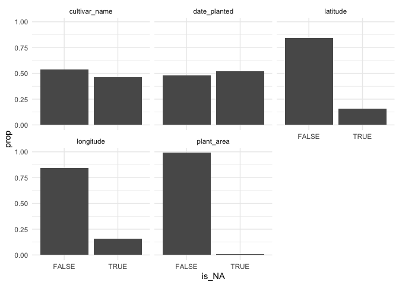
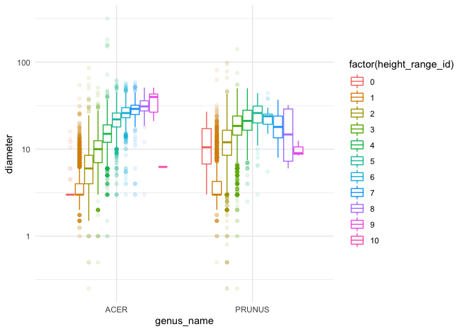
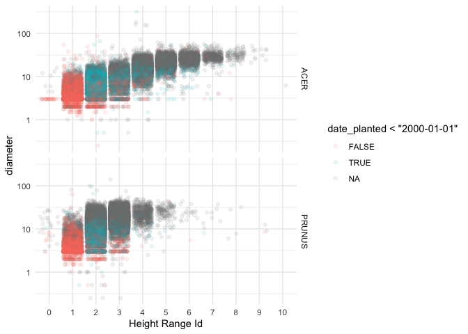
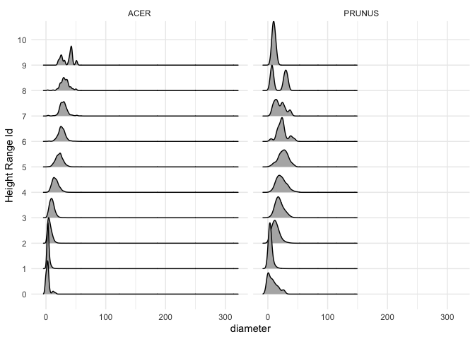
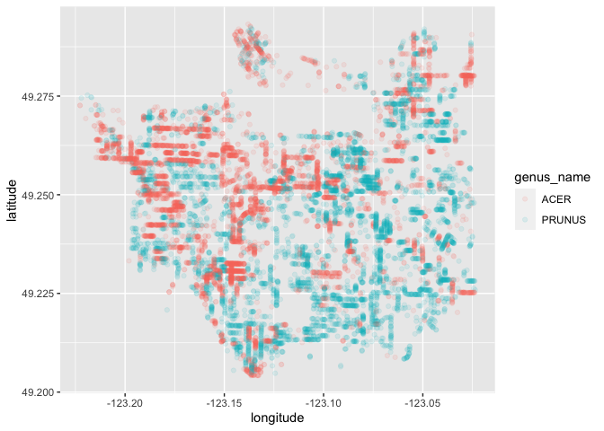

Mini Data Analysis_Milestone 1
================
Menghong Huang
10/7/2021

## Choose DataSet

#### 1. Initially select 4 datasets

There are 7 dataset from `datateachr` package. Firstly,based on the
description, I prefer to perform further exploration on the below 4
datasets because they have sufficient examples(rows \> 10000 ) and
variables(columns \>10) for multiple analysis.

-   CHOICE_1\_building_permits
-   CHOICE_2\_parking_meters
-   CHOICE_3\_steam_games
-   CHOICE_4\_vancouver_trees

#### 2. Exploring these 4 datasets:

Load required packages:

``` r
suppressPackageStartupMessages(library(datateachr))
suppressPackageStartupMessages(library(tidyverse))
```

Check the class of every dataset:

``` r
class(building_permits)
```

    ## [1] "spec_tbl_df" "tbl_df"      "tbl"         "data.frame"

``` r
class(parking_meters)
```

    ## [1] "tbl_df"     "tbl"        "data.frame"

``` r
class(steam_games)
```

    ## [1] "spec_tbl_df" "tbl_df"      "tbl"         "data.frame"

``` r
class(vancouver_trees)
```

    ## [1] "tbl_df"     "tbl"        "data.frame"

Have a glimpse on the 4 datasets

`building_permits`

-   Most of variables in `building_permits` are categorical,only the
    “project_value” is the numerical variables
-   Address information is hard to be used in data analysis
-   Limited analysis can be performed except counting and summarizing

``` r
glimpse(building_permits)
```

    ## Rows: 20,680
    ## Columns: 14
    ## $ permit_number               <chr> "BP-2016-02248", "BU468090", "DB-2016-0445…
    ## $ issue_date                  <date> 2017-02-01, 2017-02-01, 2017-02-01, 2017-…
    ## $ project_value               <dbl> 0, 0, 35000, 15000, 181178, 0, 15000, 0, 6…
    ## $ type_of_work                <chr> "Salvage and Abatement", "New Building", "…
    ## $ address                     <chr> "4378 W 9TH AVENUE, Vancouver, BC V6R 2C7"…
    ## $ project_description         <chr> NA, NA, NA, NA, NA, NA, NA, NA, NA, NA, NA…
    ## $ building_contractor         <chr> NA, NA, NA, "Mercury Contracting Ltd", "08…
    ## $ building_contractor_address <chr> NA, NA, NA, "88 W PENDER ST  \r\nUnit 2069…
    ## $ applicant                   <chr> "Raffaele & Associates DBA: Raffaele and A…
    ## $ applicant_address           <chr> "2642 East Hastings\r\nVancouver, BC  V5K …
    ## $ property_use                <chr> "Dwelling Uses", "Dwelling Uses", "Dwellin…
    ## $ specific_use_category       <chr> "One-Family Dwelling", "Multiple Dwelling"…
    ## $ year                        <dbl> 2017, 2017, 2017, 2017, 2017, 2017, 2017, …
    ## $ bi_id                       <dbl> 524, 535, 539, 541, 543, 546, 547, 548, 54…

`parking_meters`

-   Most of variables in `parking_meters` are categorical and they are
    well categorized,which can be used for grouping and summarizing the
    number of different type of parking meters
-   Only “longitude” and “latitude” are the numerical variables,which
    can be used to detect the geometric distribution of parking meters

``` r
glimpse(parking_meters)
```

    ## Rows: 10,032
    ## Columns: 22
    ## $ meter_head     <chr> "Twin", "Pay Station", "Twin", "Single", "Twin", "Twin"…
    ## $ r_mf_9a_6p     <chr> "$2.00", "$1.00", "$1.00", "$1.00", "$2.00", "$2.00", "…
    ## $ r_mf_6p_10     <chr> "$4.00", "$1.00", "$1.00", "$1.00", "$1.00", "$1.00", "…
    ## $ r_sa_9a_6p     <chr> "$2.00", "$1.00", "$1.00", "$1.00", "$2.00", "$2.00", "…
    ## $ r_sa_6p_10     <chr> "$4.00", "$1.00", "$1.00", "$1.00", "$1.00", "$1.00", "…
    ## $ r_su_9a_6p     <chr> "$2.00", "$1.00", "$1.00", "$1.00", "$2.00", "$2.00", "…
    ## $ r_su_6p_10     <chr> "$4.00", "$1.00", "$1.00", "$1.00", "$1.00", "$1.00", "…
    ## $ rate_misc      <chr> NA, "$ .50", NA, NA, NA, NA, NA, NA, NA, NA, NA, NA, NA…
    ## $ time_in_effect <chr> "METER IN EFFECT: 9:00 AM TO 10:00 PM", "METER IN EFFEC…
    ## $ t_mf_9a_6p     <chr> "2 Hr", "10 Hrs", "2 Hr", "2 Hr", "2 Hr", "3 Hr", "2 Hr…
    ## $ t_mf_6p_10     <chr> "4 Hr", "10 Hrs", "4 Hr", "4 Hr", "4 Hr", "4 Hr", "4 Hr…
    ## $ t_sa_9a_6p     <chr> "2 Hr", "10 Hrs", "2 Hr", "2 Hr", "2 Hr", "3 Hr", "2 Hr…
    ## $ t_sa_6p_10     <chr> "4 Hr", "10 Hrs", "4 Hr", "4 Hr", "4 Hr", "4 Hr", "4 Hr…
    ## $ t_su_9a_6p     <chr> "2 Hr", "10 Hrs", "2 Hr", "2 Hr", "2 Hr", "3 Hr", "2 Hr…
    ## $ t_su_6p_10     <chr> "4 Hr", "10 Hrs", "4 Hr", "4 Hr", "4 Hr", "4 Hr", "4 Hr…
    ## $ time_misc      <chr> NA, "No Time Limit", NA, NA, NA, NA, NA, NA, NA, NA, NA…
    ## $ credit_card    <chr> "No", "Yes", "No", "No", "No", "No", "No", "No", "No", …
    ## $ pay_phone      <chr> "66890", "59916", "57042", "57159", "51104", "60868", "…
    ## $ longitude      <dbl> -123.1289, -123.0982, -123.1013, -123.1862, -123.1278, …
    ## $ latitude       <dbl> 49.28690, 49.27215, 49.25468, 49.26341, 49.26354, 49.27…
    ## $ geo_local_area <chr> "West End", "Strathcona", "Riley Park", "West Point Gre…
    ## $ meter_id       <chr> "670805", "471405", "C80145", "D03704", "301023", "5913…

`steam_games`

-   `steam_games` dataset has many words-related variables which are not
    easy to be used
-   There are some missing values in numerial variables

``` r
glimpse(steam_games)
```

    ## Rows: 40,833
    ## Columns: 21
    ## $ id                       <dbl> 1, 2, 3, 4, 5, 6, 7, 8, 9, 10, 11, 12, 13, 14…
    ## $ url                      <chr> "https://store.steampowered.com/app/379720/DO…
    ## $ types                    <chr> "app", "app", "app", "app", "app", "bundle", …
    ## $ name                     <chr> "DOOM", "PLAYERUNKNOWN'S BATTLEGROUNDS", "BAT…
    ## $ desc_snippet             <chr> "Now includes all three premium DLC packs (Un…
    ## $ recent_reviews           <chr> "Very Positive,(554),- 89% of the 554 user re…
    ## $ all_reviews              <chr> "Very Positive,(42,550),- 92% of the 42,550 u…
    ## $ release_date             <chr> "May 12, 2016", "Dec 21, 2017", "Apr 24, 2018…
    ## $ developer                <chr> "id Software", "PUBG Corporation", "Harebrain…
    ## $ publisher                <chr> "Bethesda Softworks,Bethesda Softworks", "PUB…
    ## $ popular_tags             <chr> "FPS,Gore,Action,Demons,Shooter,First-Person,…
    ## $ game_details             <chr> "Single-player,Multi-player,Co-op,Steam Achie…
    ## $ languages                <chr> "English,French,Italian,German,Spanish - Spai…
    ## $ achievements             <dbl> 54, 37, 128, NA, NA, NA, 51, 55, 34, 43, 72, …
    ## $ genre                    <chr> "Action", "Action,Adventure,Massively Multipl…
    ## $ game_description         <chr> "About This Game Developed by id software, th…
    ## $ mature_content           <chr> NA, "Mature Content Description  The develope…
    ## $ minimum_requirements     <chr> "Minimum:,OS:,Windows 7/8.1/10 (64-bit versio…
    ## $ recommended_requirements <chr> "Recommended:,OS:,Windows 7/8.1/10 (64-bit ve…
    ## $ original_price           <dbl> 19.99, 29.99, 39.99, 44.99, 0.00, NA, 59.99, …
    ## $ discount_price           <dbl> 14.99, NA, NA, NA, NA, 35.18, 70.42, 17.58, N…

`vancouver_trees`

-   `vancouver_trees` has clear categorical variables for summarizing
    and useful numerical features like “diameter” to form relationship
    study
-   There is no long-words variables. Thurs, most of them can be easily
    utilized.

``` r
glimpse(vancouver_trees)
```

    ## Rows: 146,611
    ## Columns: 20
    ## $ tree_id            <dbl> 149556, 149563, 149579, 149590, 149604, 149616, 149…
    ## $ civic_number       <dbl> 494, 450, 4994, 858, 5032, 585, 4909, 4925, 4969, 7…
    ## $ std_street         <chr> "W 58TH AV", "W 58TH AV", "WINDSOR ST", "E 39TH AV"…
    ## $ genus_name         <chr> "ULMUS", "ZELKOVA", "STYRAX", "FRAXINUS", "ACER", "…
    ## $ species_name       <chr> "AMERICANA", "SERRATA", "JAPONICA", "AMERICANA", "C…
    ## $ cultivar_name      <chr> "BRANDON", NA, NA, "AUTUMN APPLAUSE", NA, "CHANTICL…
    ## $ common_name        <chr> "BRANDON ELM", "JAPANESE ZELKOVA", "JAPANESE SNOWBE…
    ## $ assigned           <chr> "N", "N", "N", "Y", "N", "N", "N", "N", "N", "N", "…
    ## $ root_barrier       <chr> "N", "N", "N", "N", "N", "N", "N", "N", "N", "N", "…
    ## $ plant_area         <chr> "N", "N", "4", "4", "4", "B", "6", "6", "3", "3", "…
    ## $ on_street_block    <dbl> 400, 400, 4900, 800, 5000, 500, 4900, 4900, 4900, 7…
    ## $ on_street          <chr> "W 58TH AV", "W 58TH AV", "WINDSOR ST", "E 39TH AV"…
    ## $ neighbourhood_name <chr> "MARPOLE", "MARPOLE", "KENSINGTON-CEDAR COTTAGE", "…
    ## $ street_side_name   <chr> "EVEN", "EVEN", "EVEN", "EVEN", "EVEN", "ODD", "ODD…
    ## $ height_range_id    <dbl> 2, 4, 3, 4, 2, 2, 3, 3, 2, 2, 2, 5, 3, 2, 2, 2, 2, …
    ## $ diameter           <dbl> 10.00, 10.00, 4.00, 18.00, 9.00, 5.00, 15.00, 14.00…
    ## $ curb               <chr> "N", "N", "Y", "Y", "Y", "Y", "Y", "Y", "Y", "Y", "…
    ## $ date_planted       <date> 1999-01-13, 1996-05-31, 1993-11-22, 1996-04-29, 19…
    ## $ longitude          <dbl> -123.1161, -123.1147, -123.0846, -123.0870, -123.08…
    ## $ latitude           <dbl> 49.21776, 49.21776, 49.23938, 49.23469, 49.23894, 4…

#### 3. Select 2 dataset for further exploration

I’d like to choose the `parking_meters` and `vancouver_trees` for
further exploring because they both have useful numerical variables to
study relationship with other variables and also their categorical
variables are clean and well-categorized,which can be used for grouping
and summarizing.

Missing values in the two datasets are not that significant. Even though
some columns in `vancouver_trees` has significant data missing, most of
columns with useful variables have no data missing. Thurs, the two
datasets are suitable for further investigation.

``` r
## % of missing values in each column in parking_meters ##
colSums(is.na(parking_meters))/10032
```

    ##     meter_head     r_mf_9a_6p     r_mf_6p_10     r_sa_9a_6p     r_sa_6p_10 
    ##   0.0000000000   0.0019936204   0.0019936204   0.0022926635   0.0019936204 
    ##     r_su_9a_6p     r_su_6p_10      rate_misc time_in_effect     t_mf_9a_6p 
    ##   0.0022926635   0.0019936204   0.9188596491   0.0036881978   0.0028907496 
    ##     t_mf_6p_10     t_sa_9a_6p     t_sa_6p_10     t_su_9a_6p     t_su_6p_10 
    ##   0.0023923445   0.0021929825   0.0023923445   0.0021929825   0.0022926635 
    ##      time_misc    credit_card      pay_phone      longitude       latitude 
    ##   0.9520534290   0.0015948963   0.0003987241   0.0000000000   0.0000000000 
    ## geo_local_area       meter_id 
    ##   0.0000000000   0.0000000000

``` r
## % of missing values in each column in vancouver_trees ##
colSums(is.na(vancouver_trees))/146611
```

    ##            tree_id       civic_number         std_street         genus_name 
    ##         0.00000000         0.00000000         0.00000000         0.00000000 
    ##       species_name      cultivar_name        common_name           assigned 
    ##         0.00000000         0.46080444         0.00000000         0.00000000 
    ##       root_barrier         plant_area    on_street_block          on_street 
    ##         0.00000000         0.01013567         0.00000000         0.00000000 
    ## neighbourhood_name   street_side_name    height_range_id           diameter 
    ##         0.00000000         0.00000000         0.00000000         0.00000000 
    ##               curb       date_planted          longitude           latitude 
    ##         0.00000000         0.52211635         0.15531577         0.15531577

#### 4. Final decision on the dataset chosen for mini-data-analysis

-   For `parking_meters`, the potential research question is to find the
    location distribution of parking meters with lowest rate in
    particular time period.

-   For `vancouver_trees`,it would be interesting to study the
    relationship between diameters and height of trees in different area
    of Vancouver.

I prefer to have the `vancouver_trees` dataset for further data
exploration.

## Exploring DataSet

Exploring `vancouver_trees` dataset

#### 1. Missing value detection by counting and plot

-   Count the number of missing values for each column. There are
    missing values in
    `cultivar_name`,`plant_area`,`date_planted`,`longitude` and
    `latitude`.

``` r
## Overview which columns have missing values ##
sum_NA=colSums(is.na(vancouver_trees))
sum_NA
```

    ##            tree_id       civic_number         std_street         genus_name 
    ##                  0                  0                  0                  0 
    ##       species_name      cultivar_name        common_name           assigned 
    ##                  0              67559                  0                  0 
    ##       root_barrier         plant_area    on_street_block          on_street 
    ##                  0               1486                  0                  0 
    ## neighbourhood_name   street_side_name    height_range_id           diameter 
    ##                  0                  0                  0                  0 
    ##               curb       date_planted          longitude           latitude 
    ##                  0              76548              22771              22771

-   Order by the number of missing values. `date_planted` has the most
    missing values.

``` r
## Order by the number of NA to identify columns with the most missing values##
as_tibble(c(feature = list(colnames(vancouver_trees)), as_tibble(sum_NA))) %>%
  rename(NA_sum=value) %>%
  mutate(nonNA_sum=146611-NA_sum)%>%
  arrange(desc(NA_sum))
```

    ## # A tibble: 20 × 3
    ##    feature            NA_sum nonNA_sum
    ##    <chr>               <dbl>     <dbl>
    ##  1 date_planted        76548     70063
    ##  2 cultivar_name       67559     79052
    ##  3 longitude           22771    123840
    ##  4 latitude            22771    123840
    ##  5 plant_area           1486    145125
    ##  6 tree_id                 0    146611
    ##  7 civic_number            0    146611
    ##  8 std_street              0    146611
    ##  9 genus_name              0    146611
    ## 10 species_name            0    146611
    ## 11 common_name             0    146611
    ## 12 assigned                0    146611
    ## 13 root_barrier            0    146611
    ## 14 on_street_block         0    146611
    ## 15 on_street               0    146611
    ## 16 neighbourhood_name      0    146611
    ## 17 street_side_name        0    146611
    ## 18 height_range_id         0    146611
    ## 19 diameter                0    146611
    ## 20 curb                    0    146611

-   Over half of data are missing in `date_planted` based on the plot
    below. Thurs, this columns may cannot be used for statistics and may
    influence the performance of data exploration.

``` r
## plot the number of non-NA values and missing values ##
vancouver_trees[, colSums(is.na(vancouver_trees)) != 0] %>%
  mutate(across(everything(),~is.na(.))) %>%
  pivot_longer(cols = everything(), 
               names_to  = "Features", 
               values_to = "is_NA") %>%
  ggplot(aes(is_NA)) +
  geom_bar(aes(y=..prop..,group=1)) +
  facet_wrap(~ Features)+
  theme_minimal()
```

<!-- -->

#### 2. Find the most popular genuses of Vancouver trees and their average diameter and height.

-   **ACER** and **PRUNUS** are much more popular in Vancouver among
    others,almost 5 times than the third one.
-   Their heights mainly in range 2 and diameters are above 10.
-   I’ll focus on the two genuses of trees to do further study.

``` r
vancouver_trees %>%
  group_by(genus_name)%>%
  summarise(diam_mean=mean(diameter),height_med=median(height_range_id),n=n())%>%
  arrange(desc(n))
```

    ## # A tibble: 97 × 4
    ##    genus_name diam_mean height_med     n
    ##    <chr>          <dbl>      <dbl> <int>
    ##  1 ACER           10.6           2 36062
    ##  2 PRUNUS         13.9           2 30683
    ##  3 FRAXINUS        9.51          2  7381
    ##  4 TILIA          13.5           4  6773
    ##  5 QUERCUS        15.2           4  6119
    ##  6 CARPINUS        9.33          2  5806
    ##  7 FAGUS           8.27          2  4808
    ##  8 MALUS           6.12          2  4173
    ##  9 MAGNOLIA        6.97          2  3899
    ## 10 CRATAEGUS       6.19          2  3864
    ## # … with 87 more rows

#### 3. The distributions of diameters for each height range for **ACER** and **PRUNUS**

Use boxplot, jitter plot and density plot to observe the distributions
by each height range

**Boxplot**

-   Generally, trees with higher height have greater diameters both in
    **ACER** and **PRUNUS** ; **PRUNUS** donnot show this trend after
    height 6,which is caused by much less data in these height range.

``` r
vancouver_trees %>%
  filter(genus_name %in% c("ACER","PRUNUS")) %>%
  ggplot(aes(genus_name,diameter,colour=factor(height_range_id)))+
  geom_boxplot(alpha=0.1)+
  scale_y_log10()+
  theme_minimal()
```

    ## Warning: Transformation introduced infinite values in continuous y-axis

    ## Warning: Removed 35 rows containing non-finite values (stat_boxplot).

<!-- -->

**Jitter plot**

-   The trees plant after year 2000 mainly have the height in range 1
    and diameter below 10. the older trees planted before 2000 have
    larger diameters and height.

-   **PRUNUS** has fewer trees with height > 6 while **ACER** still has
    some data distributed in large height range.

``` r
## ACER diameter distribution against different height range##
vancouver_trees %>%
  filter(genus_name %in% c("ACER","PRUNUS"))%>%
  ggplot(aes(factor(height_range_id),diameter,colour=date_planted<"2000-01-01"))+
  geom_jitter(alpha=0.1)+
  scale_y_log10()+
  facet_grid(genus_name ~ .)+
  xlab("Height Range Id")+
  theme_minimal()
```

    ## Warning: Transformation introduced infinite values in continuous y-axis

    ## Warning: Removed 35 rows containing missing values (geom_point).

<!-- -->

**Density_ridges**

-   The density plots have long tails where diameters are much larger
    than most of points.That means there are some thick trees with
    outstanding diameters while they are not centralized to particular
    diameter range. I’m going to further discuss these outstanding trees
    and understand why they are thicker than others for same genus(may
    related to planted locations or their ages).

``` r
## diameter density distribution of "ACER" and "PRUNUS"##
vancouver_trees %>%
  filter(genus_name %in% c("ACER","PRUNUS"))%>%
  ggplot(aes(diameter,factor(height_range_id)))+
  ggridges::geom_density_ridges()+
  facet_wrap(~ genus_name)+
  ylab("Height Range Id")+
  theme_minimal()
```

    ## Picking joint bandwidth of 1.41

    ## Picking joint bandwidth of 2.73

<!-- -->

#### 4. Find the distributions of trees with larger diameter and try to understand the reasons causing them thicker

-   plot the geographical location of trees with outstanding
    diameter(diameters > quantil 0.8)
-   It seems that thick trees of ACER are tend to locate in specific
    area, especially in the west coast. However, PRUNUS has more uniform
    distribution.

``` r
## show the distribution of thick trees in geographical location ##
vancouver_trees %>%
  filter(genus_name %in% c("ACER","PRUNUS"))%>%
  group_by(genus_name)%>%
  mutate(thick_tree=diameter>quantile(diameter,probs=0.8)) %>%
  filter(thick_tree==TRUE) %>%
  ggplot(aes(longitude,latitude,colour=genus_name))+
  geom_point(alpha=0.1)
```

    ## Warning: Removed 992 rows containing missing values (geom_point).

<!-- -->

To further exploring the linkage between thick trees and geographical
location, identify the `neighbourhood_name` with the most thick
trees(diameters>qualtil 0.8)

-   Thick ACER trees are mostly distribute in **KITSILANO**,
    **DUNBAR-SOUTHLANDS** and **SHAUGHNESSY**.
-   PRUNUS with large diameters do not cluster in particular
    neighbourhood though **KENSINGTON-CEDAR COTTAGE** has the most thick
    PRUNUS.

``` r
## identify the neighbourhood_name with the most thick trees##
vancouver_trees %>%
  filter(genus_name %in% c("ACER","PRUNUS"))%>%
  group_by(genus_name)%>%
  filter(diameter>quantile(diameter,probs=0.8)) %>%
  group_by(genus_name,neighbourhood_name)  %>%
  summarise(diam_mean=mean(diameter),height_med=median(height_range_id),n=n(),.groups = "drop") %>%
  arrange(genus_name,desc(n))
```

    ## # A tibble: 44 × 5
    ##    genus_name neighbourhood_name       diam_mean height_med     n
    ##    <chr>      <chr>                        <dbl>      <dbl> <int>
    ##  1 ACER       KITSILANO                     26.2          5   842
    ##  2 ACER       DUNBAR-SOUTHLANDS             26.2          5   802
    ##  3 ACER       SHAUGHNESSY                   26.0          5   714
    ##  4 ACER       KERRISDALE                    25.3          5   660
    ##  5 ACER       HASTINGS-SUNRISE              24.3          5   479
    ##  6 ACER       WEST POINT GREY               25.7          5   430
    ##  7 ACER       RILEY PARK                    25.2          5   357
    ##  8 ACER       MARPOLE                       25.8          4   267
    ##  9 ACER       KENSINGTON-CEDAR COTTAGE      25.5          5   261
    ## 10 ACER       WEST END                      26.6          5   239
    ## # … with 34 more rows

## Research Questions

-   What is the relationship between the age of trees with `diameter` or
    `height_range_id`. I plan to calculate the ages based on the
    `date_planted` and the date today.
-   Exploring the distributions of trees with larger Height (greater
    than the median of `height_range_id`) in different planted
    locations.
-   What’s the major genuses of trees, height range and diameter range
    for different `plant_area`?
-   How the street characteristics (like
    `root_barrier`,`street_side_name` etc.) influence the number of
    trees and its diameters?
