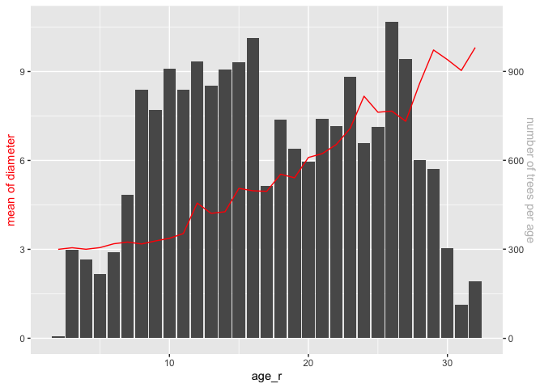
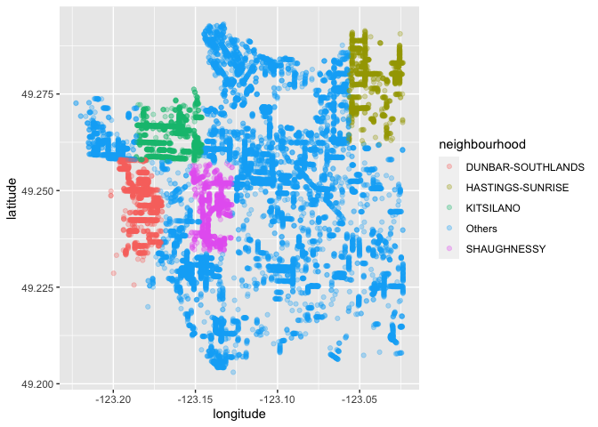
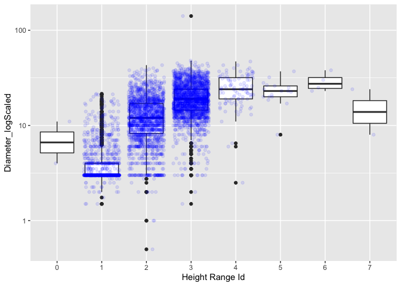
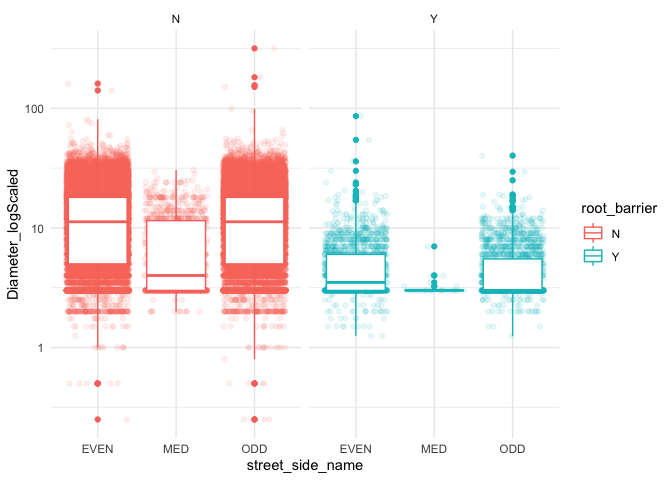

Mini Data Analysis Milestone 2
================

*To complete this milestone, you can either edit [this `.rmd`
file](https://raw.githubusercontent.com/UBC-STAT/stat545.stat.ubc.ca/master/content/mini-project/mini-project-2.Rmd)
directly. Fill in the sections that are commented out with
`<!--- start your work here--->`. When you are done, make sure to knit
to an `.md` file by changing the output in the YAML header to
`github_document`, before submitting a tagged release on canvas.*

# Welcome back to your mini data analysis project!

This time, we will explore more in depth the concept of *tidy data*, and
hopefully investigate further into your research questions that you
defined in milestone 1.

**NOTE**: The main purpose of the mini data analysis is to integrate
what you learn in class in an analysis. Although each milestone provides
a framework for you to conduct your analysis, it’s possible that you
might find the instructions too rigid for your data set. If this is the
case, you may deviate from the instructions – just make sure you’re
demonstrating a wide range of tools and techniques taught in this class.

Begin by loading your data and the tidyverse package below:

``` r
library(datateachr) # <- might contain the data you picked!
library(tidyverse)
```

# Learning Objectives

By the end of this milestone, you should:

-   Become familiar with manipulating and summarizing your data in
    tibbles using `dplyr` and `tidyr`, with a research question in mind.
-   Understand what *tidy* data is, and how to create it. In milestone
    3, we will explore when this might be useful.
-   Generate a reproducible and clear report using R Markdown.
-   Gain a greater understanding of how to use R to answer research
    questions about your data.

**Things to keep in mind**

-   Remember to document your code, be explicit about what you are
    doing, and write notes in this markdown document when you feel that
    context is required. Create your analysis as if someone else will be
    reading it! **There will be 2.5 points reserved for reproducibility,
    readability, and repo organization.**

-   Before working on each task, you should always keep in mind the
    specific **research question** that you’re trying to answer.

# Task 1: Process and summarize your data (15 points)

From milestone 1, you should have an idea of the basic structure of your
dataset (e.g. number of rows and columns, class types, etc.). Here, we
will start investigating your data more in-depth using various data
manipulation functions.

### 1.1 (2.5 points)

First, write out the 4 research questions you defined in milestone 1
were. This will guide your work through milestone 2:

<!-------------------------- Start your work below ---------------------------->

-   The `vancouver_tree` dataset is what I choose for all the milestones
    of my mini-data analysis project. The four research questions are:

1.  *What is the relationship between the age of trees with `diameter`
    or `height_range_id`?*
2.  *Exploring the distributions of trees with larger Height (greater
    than the median of `height_range_id`) in different planted
    locations.*
3.  *What’s the major genuses of trees, height range and diameter range
    for different `plant_area`?*
4.  *How the street characteristics (like
    `root_barrier`,`street_side_name` etc.) influence the number of
    trees and its diameters？*
    <!----------------------------------------------------------------------------->

### 1.2 (10 points)

Now, for each of your four research questions, choose one task from
options 1-4 (summarizing), and one other task from 4-8 (graphing). You
should have 2 tasks done for each research question (8 total). Make sure
it makes sense to do them! (e.g. don’t use a numerical variables for a
task that needs a categorical variable.). Comment on why each task helps
(or doesn’t!) answer the corresponding research question.

Ensure that the output of each operation is printed!

**Summarizing:**

1.  Compute the *range*, *mean*, and *two other summary statistics* of
    **one numerical variable** across the groups of **one categorical
    variable** from your data.
2.  Compute the number of observations for at least one of your
    categorical variables. Do not use the function `table()`!
3.  Create a categorical variable with 3 or more groups from an existing
    numerical variable. You can use this new variable in the other
    tasks! *An example: age in years into “child, teen, adult, senior”.*
4.  Based on two categorical variables, calculate two summary statistics
    of your choosing.

**Graphing:**

5.  Create a graph out of summarized variables that has at least two
    geom layers.
6.  Create a graph of your choosing, make one of the axes logarithmic,
    and format the axes labels so that they are “pretty” or easier to
    read.
7.  Make a graph where it makes sense to customize the alpha
    transparency.
8.  Create 3 histograms out of summarized variables, with each histogram
    having different sized bins. Pick the “best” one and explain why it
    is the best.

Make sure it’s clear what research question you are doing each operation
for!

<!------------------------- Start your work below ----------------------------->

**For Question 1:** *What is the relationship between the age of trees
with `diameter` or `height_range_id`?*

-   I’ll firstly derive the ages using the date today to minus the
    `date_planted`. Thurs, the age can work as a numerical summarized
    variable for relationship study;

-   Then, summarize the range,mean,median, 0.9 quantile of age and the
    number of trees by each height range.

-   The result shows the age of trees in the range of 2 to 32 years old.
    Trees in larger height range normally have older age. However, there
    are rare trees in height range >6 so that the trend is influenced by
    lacking of enough observations in these height.

``` r
## calculate ages of trees based on `date_planted`  and save result in `vanTrees_sub`##
today <- Sys.Date()
vanTrees_sub<-vancouver_trees %>%
  filter(!is.na(date_planted))  %>%
  mutate(age=as.numeric(today-date_planted)/365.25)

## summarize the statistics of age for each height range##
vanTrees_sub%>%
  group_by(height_range_id) %>%
  summarise(min(age),max(age),mean(age),median(age),quantile(age,probs=0.9),n=n())
```

    ## # A tibble: 11 × 7
    ##    height_range_id `min(age)` `max(age)` `mean(age)` `median(age)`
    ##              <dbl>      <dbl>      <dbl>       <dbl>         <dbl>
    ##  1               0       2.80       32.0        12.7          11.6
    ##  2               1       2.32       31.9        12.2          11.8
    ##  3               2       2.44       32.0        22.3          22.9
    ##  4               3       2.72       32.0        23.5          23.8
    ##  5               4       2.54       32.0        24.5          24.8
    ##  6               5       2.86       31.8        24.9          25.0
    ##  7               6       3.62       32.0        23.4          23.8
    ##  8               7      11.1        31.8        21.5          21.5
    ##  9               8      14.9        28.6        20.3          20.3
    ## 10               9      15.7        25.9        20.6          21.3
    ## 11              10      23.8        23.8        23.8          23.8
    ## # … with 2 more variables: quantile(age, probs = 0.9) <dbl>, n <int>

-   To identify the trend between age and diameter, I initially
    calculate the mean of diameter for each age integer since the
    diameter of trees almost don’t changed a lot within one year. If not
    do that, the points are clustered around each age integer and cannot
    form a line of diameter cross age;

-   The first layer is the bar chart of the tree number in each age
    integer and it’s represented as a background to help with
    understanding how many data used for the mean value of diameter.

-   The second layer of below plot is the line chart of diameter cross
    age.

``` r
## plot the relationship between age and the mean diameter of trees in same age ##
vanTrees_sub %>%
  filter(genus_name=="ACER",diameter!=0) %>%
  mutate(age_r=round(age)) %>%
  group_by(age_r) %>%
  summarise(diam_mean=mean(diameter),height_med=median(height_range_id),n=n()) %>%
  ggplot(aes(age_r,y=diam_mean)) +
  geom_col(aes(y=n/100),position = "dodge")+
  geom_line(color="red") +
  scale_y_continuous("mean of diameter", sec.axis = sec_axis(~. *100, name = "number of trees per age"))+
  theme(axis.title.y.right=element_text(colour="grey"),
        axis.title.y=element_text(colour="red"))
```

<!-- -->

**For Question 2:** *Exploring the distributions of trees with larger
Height (greater than the median of `height_range_id`) in different
planted locations.*

-   Summarize the number of higher trees(> the median of
    `height_range_id` for its genus) and what the median value of higher
    trees by genus and neighbourhood.

-   It can be seen that **ACER** has higher trees mainly in
    “KITSILANO”,“DUNBAR-SOUTHLANDS”,“HASTINGS-SUNRISE”,“SHAUGHNESSY” and
    their height range are around 4 \~ 5.

``` r
## summarize the number of trees with extreme height for each genus of trees ##
vancouver_trees %>%
  group_by(genus_name)%>%
  mutate(height_med=median(height_range_id)) %>%
  filter(height_range_id> height_med) %>%
  group_by(genus_name,neighbourhood_name,height_med) %>%
  summarise(num_highTree=n(),med_highTree=median(height_range_id),.groups = "drop") %>%
  arrange(desc(num_highTree))
```

    ## # A tibble: 979 × 5
    ##    genus_name neighbourhood_name       height_med num_highTree med_highTree
    ##    <chr>      <chr>                         <dbl>        <int>        <dbl>
    ##  1 ACER       KITSILANO                         2         1481            5
    ##  2 ACER       DUNBAR-SOUTHLANDS                 2         1362            5
    ##  3 ACER       HASTINGS-SUNRISE                  2         1265            4
    ##  4 ACER       SHAUGHNESSY                       2         1127            5
    ##  5 PRUNUS     VICTORIA-FRASERVIEW               2         1096            3
    ##  6 PRUNUS     RENFREW-COLLINGWOOD               2         1027            3
    ##  7 ACER       KERRISDALE                        2         1024            5
    ##  8 PRUNUS     KENSINGTON-CEDAR COTTAGE          2         1019            3
    ##  9 ACER       KENSINGTON-CEDAR COTTAGE          2          956            4
    ## 10 ACER       MOUNT PLEASANT                    2          906            4
    ## # … with 969 more rows

-   Plot the geographical location of trees with greater height(> the
    median of `height_range_id`) to visualize their distributions in
    map. The four major neighbourhood for **ACER** high trees are
    highlighted in below plot.

-   High trees of **ACER** are mainly distributed in west side of
    Vancouver while HASTINGS-SUNRISE also has high trees densely
    distributed.

``` r
vancouver_trees %>%
  group_by(genus_name)%>%
  mutate(height_med=median(height_range_id),height_max=max(height_range_id)) %>%
  filter(height_range_id>height_med) %>%
  filter(genus_name=="ACER") %>%
  mutate(neighbourhood=if_else(neighbourhood_name %in% c("KITSILANO","DUNBAR-SOUTHLANDS","HASTINGS-SUNRISE","SHAUGHNESSY"), neighbourhood_name,"Others"))%>%
  ggplot(aes(longitude,latitude,colour=neighbourhood))+
  geom_point(alpha=0.3)
```

    ## Warning: Removed 1889 rows containing missing values (geom_point).

<!-- -->

**For Question 3:** *What’s the major genuses of trees, height range and
diameter range for different `plant_area`?*

-   Summarize the number of each genus of trees, its range,mean of
    diameter and also the height median and range by `plant_area`(where
    a number indicates boulevard width in feet, B = behind sidewalk, G =
    in tree grate, N = no sidewalk, C = cutout) .

-   For plant_area 10(boulevard with width in 10 feet), the major genus
    of trees are **PRUNUS**,**ACER** and **FRAXINUS**; The diameter of
    **PRUNUS** and **ACER** are about 14 in mean while **PRUNUS** has a
    wider range. The heights of these 3 major genus are in range 2 or 3
    in median and generally **ACER** is taller than **PRUNUS** .

``` r
pa_summ<-vancouver_trees %>%
  group_by(plant_area) %>%
  mutate(totalTree_pa=n()) %>%
  group_by(plant_area,totalTree_pa,genus_name) %>%
  summarise(n=n(),mean(diameter),min(diameter),max(diameter),median(height_range_id),min(height_range_id),max(height_range_id),.groups="drop") %>%
  arrange(desc(totalTree_pa),desc(n))

pa_summ
```

    ## # A tibble: 1,565 × 10
    ##    plant_area totalTree_pa genus_name     n `mean(diameter)` `min(diameter)`
    ##    <chr>             <int> <chr>      <int>            <dbl>           <dbl>
    ##  1 10                20467 PRUNUS      5578            14.6             0   
    ##  2 10                20467 ACER        5020            14.1             0   
    ##  3 10                20467 FRAXINUS    1124            10.6             0   
    ##  4 10                20467 QUERCUS      862            17.4             1.75
    ##  5 10                20467 TILIA        772            14.6             3   
    ##  6 10                20467 MALUS        703             6.52            0   
    ##  7 10                20467 ULMUS        615            25.0             3   
    ##  8 10                20467 MAGNOLIA     554             9.17            1   
    ##  9 10                20467 AESCULUS     476            24.0             3   
    ## 10 10                20467 CRATAEGUS    453             6.43            0   
    ## # … with 1,555 more rows, and 4 more variables: max(diameter) <dbl>,
    ## #   median(height_range_id) <dbl>, min(height_range_id) <dbl>,
    ## #   max(height_range_id) <dbl>

-   Further summarize to get the top 1 popular genus of tree in each
    kind of plant_area. **PRUNUS** and **ACER** are the most popular one
    in most of plant area.

``` r
pa_summ %>%
  group_by(plant_area) %>%
  summarise(across(everything(),first)) %>%
  arrange(desc(totalTree_pa))
```

    ## # A tibble: 49 × 10
    ##    plant_area totalTree_pa genus_name     n `mean(diameter)` `min(diameter)`
    ##    <chr>             <int> <chr>      <int>            <dbl>           <dbl>
    ##  1 10                20467 PRUNUS      5578            14.6             0   
    ##  2 8                 15742 PRUNUS      4517            14.3             0   
    ##  3 N                 14007 PRUNUS      2814            12.6             0   
    ##  4 6                 13856 PRUNUS      3245            14.2             0   
    ##  5 7                 11864 PRUNUS      3150            15.7             0   
    ##  6 12                 9198 PRUNUS      2377            13.5             0.25
    ##  7 4                  9100 ACER        2792             7.50            0.5 
    ##  8 B                  8899 ACER        1896            10.4             1   
    ##  9 C                  8320 ACER        3016             7.32            1   
    ## 10 3                  7919 ACER        2286             6.87            2   
    ## # … with 39 more rows, and 4 more variables: max(diameter) <dbl>,
    ## #   median(height_range_id) <dbl>, min(height_range_id) <dbl>,
    ## #   max(height_range_id) <dbl>

-   Plot the distribution of height and diameter for **PRUNUS** trees in
    plant_area 10.

-   Most of trees have height in range 2 and range 3 and diameter are
    normally greater for trees in range 3 compared with that in lower
    height range.

``` r
vancouver_trees %>%
  filter(plant_area==10,genus_name=="PRUNUS",diameter!=0)  %>%
  ggplot(aes(factor(height_range_id),diameter)) +
  geom_boxplot()+
  geom_jitter(alpha=0.1,colour="blue")+
  scale_y_log10()+
  xlab("Height Range Id")+
  ylab("Diameter_logScaled")
```

<!-- -->

**For Question 4:** *How the street characteristics (like
`root_barrier`,`street_side_name` etc.) influence the number of trees
and its diameters？*

-   Based on `root_barrier` and `street_side_name` to count the number
    of trees in each category and summarize their mean of diameter and
    the median of height range. filtered trees of ACER and PRUNUS since
    they are the most popular trees and they have similar diameter and
    height.

-   Trees with root barrier normally have smaller diameters than trees
    without root barrier.

-   Trees located in median area of street generally have smaller
    diameter than that in the two sides of street.

``` r
vancouver_trees %>%
  filter(genus_name %in% c("ACER","PRUNUS")) %>%
  group_by(root_barrier,street_side_name)  %>%
  summarise(diam_mean=mean(diameter),height_med=median(height_range_id),n=n(),.groups="drop")%>%
  arrange(root_barrier,desc(n))
```

    ## # A tibble: 10 × 5
    ##    root_barrier street_side_name diam_mean height_med     n
    ##    <chr>        <chr>                <dbl>      <dbl> <int>
    ##  1 N            ODD                  12.7         2   30823
    ##  2 N            EVEN                 12.7         2   30755
    ##  3 N            MED                   7.21        2    1092
    ##  4 N            PARK                  3           1      51
    ##  5 N            BIKE MED              3.03        1.5    16
    ##  6 N            GREENWAY             15           2       1
    ##  7 Y            ODD                   4.61        1    2100
    ##  8 Y            EVEN                  4.86        1    1863
    ##  9 Y            MED                   3.26        1      27
    ## 10 Y            BIKE MED              3           1      17

-   Plot the jitterPlot and boxplot to better show the distributions of
    diameter value for each street side and status of root barrier
    installation.

-   It is obvious that trees planted in even and odd side have similar
    diameters while the median ones are much thinner.

-   Trees with root barrier are much thinner no matter in which side of
    streets trees are planted.

``` r
vancouver_trees %>%
  filter(genus_name %in% c("ACER","PRUNUS")) %>%
  filter(diameter!=0,street_side_name %in% c("MED","ODD","EVEN"))%>%
  ggplot(aes(street_side_name,diameter,color=root_barrier))+
  geom_jitter(alpha=0.1)+
  geom_boxplot()+
  facet_wrap(~ root_barrier)+
  scale_y_log10()+
  ylab("Diameter_logScaled")+
  theme_minimal()
```

<!-- -->

<!----------------------------------------------------------------------------->

### 1.3 (2.5 points)

Based on the operations that you’ve completed, how much closer are you
to answering your research questions? Think about what aspects of your
research questions remain unclear. Can your research questions be
refined, now that you’ve investigated your data a bit more? Which
research questions are yielding interesting results?

<!------------------------- Write your answer here ---------------------------->

-   For Question 1, the trend between age and diameter is identified and
    as expected. However, it may need a better way to process the
    `date_plant` variable since the age calculated can not be truly used
    as a numerical variable in relationship study; A linear model can be
    used to fit the diameter across age to better interpret the
    relationship. Thurs,these two tasks can go into further study.

-   For Question 2, the geographical distribution of high trees are
    visualized and the major areas of high trees are founded. I suppose
    question 2 is answered. The four major areas are similar as the
    thick-tree area which is studied in milestone 1.

-   For Question 3, the major genus of tree in different plant_area is
    identified. However, it still need to be studied that if plant_area
    influence the diameters or height of trees.

-   For Question 4, the conclusion can be draw that root barriers have
    inverse influence on trees’ diameter and trees planted on median of
    street are normally thinner than that in two sides of street. That
    both intuitively make sense.

<!----------------------------------------------------------------------------->

# Task 2: Tidy your data (12.5 points)

In this task, we will do several exercises to reshape our data. The goal
here is to understand how to do this reshaping with the `tidyr` package.

A reminder of the definition of *tidy* data:

-   Each row is an **observation**
-   Each column is a **variable**
-   Each cell is a **value**

*Tidy’ing* data is sometimes necessary because it can simplify
computation. Other times it can be nice to organize data so that it can
be easier to understand when read manually.

### 2.1 (2.5 points)

Based on the definition above, can you identify if your data is tidy or
untidy? Go through all your columns, or if you have \>8 variables, just
pick 8, and explain whether the data is untidy or tidy.

<!--------------------------- Start your work below --------------------------->

``` r
head(vancouver_trees)
```

    ## # A tibble: 6 × 20
    ##   tree_id civic_number std_street genus_name species_name cultivar_name  
    ##     <dbl>        <dbl> <chr>      <chr>      <chr>        <chr>          
    ## 1  149556          494 W 58TH AV  ULMUS      AMERICANA    BRANDON        
    ## 2  149563          450 W 58TH AV  ZELKOVA    SERRATA      <NA>           
    ## 3  149579         4994 WINDSOR ST STYRAX     JAPONICA     <NA>           
    ## 4  149590          858 E 39TH AV  FRAXINUS   AMERICANA    AUTUMN APPLAUSE
    ## 5  149604         5032 WINDSOR ST ACER       CAMPESTRE    <NA>           
    ## 6  149616          585 W 61ST AV  PYRUS      CALLERYANA   CHANTICLEER    
    ## # … with 14 more variables: common_name <chr>, assigned <chr>,
    ## #   root_barrier <chr>, plant_area <chr>, on_street_block <dbl>,
    ## #   on_street <chr>, neighbourhood_name <chr>, street_side_name <chr>,
    ## #   height_range_id <dbl>, diameter <dbl>, curb <chr>, date_planted <date>,
    ## #   longitude <dbl>, latitude <dbl>

The `vancouver_tree` dataset is tidy for every column. Each row
represent a unique tree with an unique tree_id and each column gives
different information of this tree,so called the variables of trees. And
each cell is the corresponding value of a particular variable of each
tree.

<!----------------------------------------------------------------------------->

### 2.2 (5 points)

Now, if your data is tidy, untidy it! Then, tidy it back to it’s
original state.

If your data is untidy, then tidy it! Then, untidy it back to it’s
original state.

Be sure to explain your reasoning for this task. Show us the “before”
and “after”.

<!--------------------------- Start your work below --------------------------->

-   Firstly, untidy the data via pivot_longer to put the name_related
    variables into `name_type` column and their values into `name`
    column.

``` r
vanTree_untidy <- vancouver_trees %>%
  pivot_longer(cols = c(genus_name,species_name,cultivar_name,common_name),
               names_to = "name_type",
               values_to = "name") %>%
  select(tree_id:std_street,name_type,name,everything())
  
head(vanTree_untidy)
```

    ## # A tibble: 6 × 18
    ##   tree_id civic_number std_street name_type     name        assigned root_barrier
    ##     <dbl>        <dbl> <chr>      <chr>         <chr>       <chr>    <chr>       
    ## 1  149556          494 W 58TH AV  genus_name    ULMUS       N        N           
    ## 2  149556          494 W 58TH AV  species_name  AMERICANA   N        N           
    ## 3  149556          494 W 58TH AV  cultivar_name BRANDON     N        N           
    ## 4  149556          494 W 58TH AV  common_name   BRANDON ELM N        N           
    ## 5  149563          450 W 58TH AV  genus_name    ZELKOVA     N        N           
    ## 6  149563          450 W 58TH AV  species_name  SERRATA     N        N           
    ## # … with 11 more variables: plant_area <chr>, on_street_block <dbl>,
    ## #   on_street <chr>, neighbourhood_name <chr>, street_side_name <chr>,
    ## #   height_range_id <dbl>, diameter <dbl>, curb <chr>, date_planted <date>,
    ## #   longitude <dbl>, latitude <dbl>

-   Tidy it back via pivot_wider

``` r
vanTree_tidy <- vanTree_untidy %>%
  pivot_wider(id_cols= c(- name_type,- name),
              names_from = name_type,
              values_from = name
  ) %>%
  select(tree_id:std_street,genus_name:common_name,everything())
head(vanTree_tidy)
```

    ## # A tibble: 6 × 20
    ##   tree_id civic_number std_street genus_name species_name cultivar_name  
    ##     <dbl>        <dbl> <chr>      <chr>      <chr>        <chr>          
    ## 1  149556          494 W 58TH AV  ULMUS      AMERICANA    BRANDON        
    ## 2  149563          450 W 58TH AV  ZELKOVA    SERRATA      <NA>           
    ## 3  149579         4994 WINDSOR ST STYRAX     JAPONICA     <NA>           
    ## 4  149590          858 E 39TH AV  FRAXINUS   AMERICANA    AUTUMN APPLAUSE
    ## 5  149604         5032 WINDSOR ST ACER       CAMPESTRE    <NA>           
    ## 6  149616          585 W 61ST AV  PYRUS      CALLERYANA   CHANTICLEER    
    ## # … with 14 more variables: common_name <chr>, assigned <chr>,
    ## #   root_barrier <chr>, plant_area <chr>, on_street_block <dbl>,
    ## #   on_street <chr>, neighbourhood_name <chr>, street_side_name <chr>,
    ## #   height_range_id <dbl>, diameter <dbl>, curb <chr>, date_planted <date>,
    ## #   longitude <dbl>, latitude <dbl>

<!----------------------------------------------------------------------------->

### 2.3 (5 points)

Now, you should be more familiar with your data, and also have made
progress in answering your research questions. Based on your interest,
and your analyses, pick 2 of the 4 research questions to continue your
analysis in milestone 3, and explain your decision.

Try to choose a version of your data that you think will be appropriate
to answer these 2 questions in milestone 3. Use between 4 and 8
functions that we’ve covered so far (i.e. by filtering, cleaning,
tidy’ing, dropping irrelvant columns, etc.).

<!--------------------------- Start your work below --------------------------->

I’m going to pick question 1 and question 3 for further analysis in
milestone 3. They are:

-   *What is the relationship between the age of trees with `diameter`
    or `height_range_id`?*

-   *What’s the major genuses of trees, height range and diameter range
    for different `plant_area`?*

Because in Question 1, I plan to use `lubridate` package to better
process date information in ‘date_planted’ to make it truly numerical
and fit it with diameter in linear model to quantitively derive the
relationship.

The reason for choosing Question 3 is that the influence of `plant_area`
on diameter/height of trees is to be discovered. Thurs, I’ll refine the
Question 3 as “How `plant_area` influence the diameter or the height of
trees?”

Thurs, the final 2 questions for milestone 3 are:

-   *What is the relationship between the age of trees with `diameter`
    or `height_range_id`?*

-   *How `plant_area` influence the diameter or the height of trees?*

<!----------------------------------------------------------------------------->

*When you are done, knit an `md` file. This is what we will mark! Make
sure to open it and check that everything has knitted correctly before
submitting your tagged release.*

### Attribution

Thanks to Victor Yuan for mostly putting this together.
